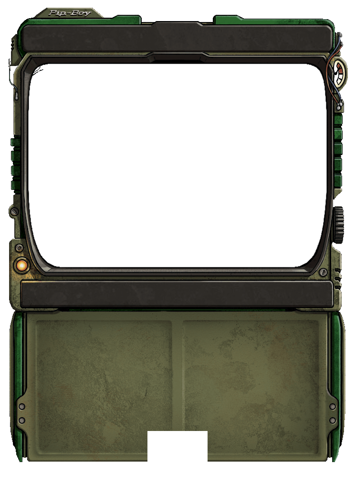

# Scorpious187's Pip Boy

A **Pip-Boy interface** for the [Fallout: The Roleplaying Game](https://foundryvtt.com/packages/fallout)
system on **Foundry VTT v13–v14**. Open it from the Token HUD to view a character's
status, inventory, data, and map on tabs — inside an authentic Pip-Boy casing,
styled after the in-game Pip-Boy from Fallout 3 / 4 / New Vegas.



---

## Installation

In Foundry: **Add-on Modules → Install Module**, and paste this manifest URL:

```
https://github.com/nscarpinatodev/scorpious187s-pip-boy/releases/latest/download/module.json
```

Then enable **Scorpious187's Pip Boy** in your world's module settings.

### Requirements

- Foundry VTT **v13+** (verified on **v14**)
- The **`fallout`** system (Fallout: The Roleplaying Game) **v11+**

---

## Opening the Pip-Boy

Select a **character** token, then click the **Pip-Boy button** in the left column
of the **Token HUD**. (You can also call `game.modules.get("scorpious187s-pip-boy").api.open(actor)`
from a macro.)

---

## Features

### STATUS tab
- **HP bar** with inline `−` / `+` buttons to damage or heal by 1 (clamped to max).
- **Vitals**: Defense, Initiative, Rads, Luck points, Caps, and carried weight
  (current / capacity, turns red when encumbered).
- **Condition figure** — a Vault-Boy-style body diagram (built from the fallout
  system's own limb art) that colours each limb by status: phosphor = healthy,
  amber = wounded, red = crippled.
- **Injury pips** — each limb has clickable pips that cycle
  *none → wounded → crippled*, updating the limb status and figure live.
- **S.P.E.C.I.A.L.** attributes.
- **NEEDS** — Hunger, Thirst, and Sleep shown as their descriptive levels
  (e.g. *Sated*, *Hydrated*, *Rested*), plus Fatigue and Intoxication.

### INV (inventory) tab
- Items grouped into **Weapons / Apparel / Aid / Ammo / Misc**, with quantity and
  weight, and a total carried / capacity readout.
- **Equip toggle** on equippable items.
- **Attack** (crosshairs) and **Damage** (burst) rolls on weapons — these open the
  fallout system's own 2d20 and combat-dice dialogs, so ammo, AP, hit locations,
  and chat cards all behave exactly like the character sheet.
- **Use** on consumables — runs the system's `consumeItem` (quantity, hunger,
  HP/rad healing, effects).
- Items with **zero quantity are hidden**.

### DATA tab
- **Level & XP**, origin.
- **Skills** — left-click a skill to roll it against its default attribute;
  **right-click** to reveal a S.P.E.C.I.A.L. picker and roll against any attribute.
- **Perks** (with rank for multi-rank perks) and **Traits**.

### MAP tab
Toggle between two modes (each appears when available), with **wheel-zoom**,
**drag-pan**, and a **recentre** button:
- **World Map** — a GM-configured scene centred on a shared **party token**, tinted
  to the Pip-Boy screen colour. Re-centres live as the party token moves.
- **Local Map** — the **active scene** centred on **your** character's token.
  Shows only the scene's background art (no tokens, so no enemy positions leak).
  Re-centres as you move.

### Lower readout
Clicking an item, perk, or trait (or rolling a skill) shows its **description** in
the lower panel of the Pip-Boy casing — no extra window. The panel clears when you
switch tabs or select something new.

### Presentation
- **8 frame colours** with matching CRT phosphor tint (per-client setting).
- CRT scanlines, glow, and a transparent window background so only the casing shows.
  Scanlines can be turned off per-client in Module Settings for readability.
- The **dial wheel** on the right edge of the casing opens the settings sheet.
- **Live updates** from the actor, its items, and token movement.
- **Per-tab scroll positions are preserved** across re-renders.

---

## Settings

- **Pip-Boy Frame Colour** *(per client)* — the casing colour; the screen tint
  follows it.
- **World Map** *(GM)* — **Game Settings → Configure Settings → Scorpious187's Pip
  Boy → Configure World Map**: choose the world-map **scene**, the **party token**
  (an actor all players own), and the map **zoom**.

---

## Development

The module is plain ES modules, Handlebars templates, and CSS — no build step for
the source itself.

```powershell
# Copy the module into your local Foundry data folder for testing:
./deploy.ps1

# Package a distributable module.zip (same artifact CI produces):
./build.ps1
```

### Releasing

Pushing a version tag triggers the GitHub Actions workflow
([.github/workflows/release.yml](.github/workflows/release.yml)), which stamps
`module.json`, builds `module.zip`, and publishes a GitHub release:

```bash
git tag v0.1.0
git push origin v0.1.0
```

---

## Credits & License

Released under the [MIT License](LICENSE).

The Vault-Boy-style limb figure and the roll dialogs are provided at
runtime by the **fallout** system (Fallout: The Roleplaying Game by Muttley &
contributors); no system assets are bundled in this module. "Fallout" and
"Pip-Boy" are trademarks of Bethesda Softworks; this is an unofficial, non-
commercial fan project.
